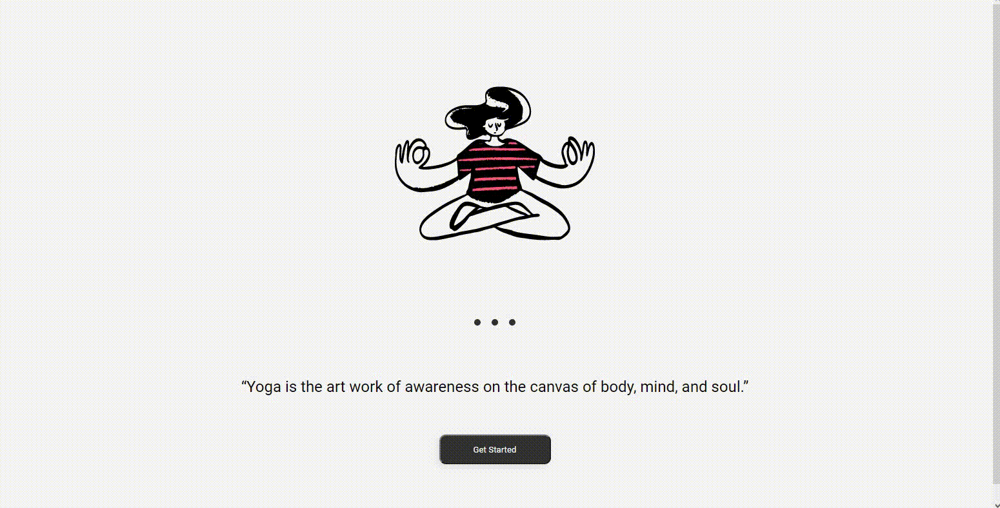

<h1 align="center">🪷 Yoga Home Page</h1>

> This is a page screen application for a yoga app.

Check the application: https://kayke-fujinaka.github.io/Yoga-Interface/

## :page_facing_up: Explanation

Welcome to Yoga Home Page, your destination for yoga and wellness. Our studio is dedicated to promoting physical, mental, and spiritual well-being through the practice of yoga.

## :dart: Features ##

:heavy_check_mark: Structure;\
:heavy_check_mark: Style;\
:heavy_check_mark: Finalizado;

## 🚀 Technologies

This project was developed using the following technologies:

- [HTML5](https://developer.mozilla.org/pt-BR/docs/Web/HTML/Element/html/)  
- [CSS3](https://developer.mozilla.org/pt-BR/docs/Web/CSS)

## 🤝 Contributors

We want to thank the following people who contributed to this project:

<table>
  <tr>
    <td align="center">
      <a href="#">
         
        
          <b>Kayke Fujinaka</b>
        
      </a>
    </td>
  </tr>
</table>

## 📝 License

This project is under license. See the [LICENSE](LICENSE.md) file for more details.

&#xa0;

<a href="#top">Back to top</a>

